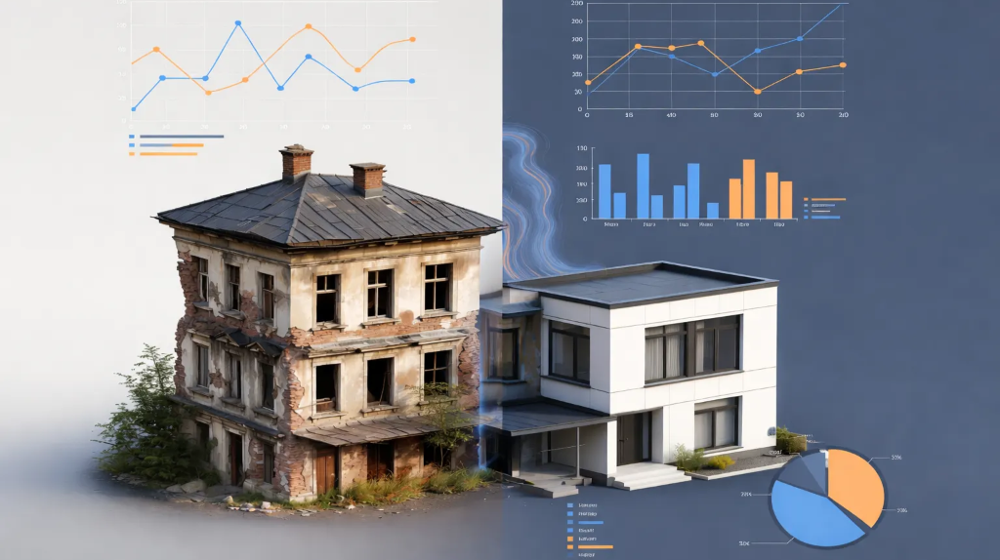

#  Daejeon Energy Insight (E-PRO)

> **"데이터 기반의 도심 에너지 효율 최적화 플랫폼"**  
> 대전광역시 3D 건물 에너지 통합 분석 및 AI 소비 예측 시뮬레이터



##  프로젝트 개요 (Project Overview)

**Daejeon Energy Insight**는 대전광역시의 건물 에너지(전기/가스) 사용량을 **3D 지도(V-World)** 기반으로 시각화하고, **AI(Prophet)**를 활용해 미래 에너지 수요를 예측하는 통합 관리 플랫폼입니다.
단순한 통계 조회를 넘어, 개별 건물의 에너지 효율을 정밀 진단하고 이웃 건물과 비교(Benchmarking)함으로써 **'노후 건물'의 에너지 낭비 문제**를 데이터로 입증하고 개선 방향을 제시합니다.

---

##  핵심 기능 (Key Features)

### 1. 3D 건물 시각화 (3D Visualization)
- **V-World WebGL API**를 활용하여 대전시 전역의 건물을 실제와 같은 3D로 구현했습니다.
- **노후도 시각화**: 건축물 대장 데이터를 기반으로 건물의 연식에 따라 `신축(0~9년)`부터 `노후(30년+)`까지 **붉은색 계열(Red-Scale)**로 색상을 다르게 표현하여, 노후된 건물을 직관적으로 식별할 수 있습니다.

### 2. AI 에너지 예측 시뮬레이터 (AI Energy Forecaster)
- **Facebook Prophet** 알고리즘을 적용하여 향후 1년(12개월)의 에너지 소비 패턴을 미리 예측합니다.
- **계절성 반영**: 겨울철 난방, 여름철 냉방 등 계절에 따른 에너지 사용 변화를 정교하게 학습하여, 단순한 직선이 아닌 실제 패턴과 유사한 예측 그래프를 제공합니다.
- **실시간 시뮬레이션**: 사용자가 `건물 노후도`, `주택 유형` 등의 조건을 변경하면, AI 모델이 예측한 새로운 그래프를 실시간으로 보여줍니다.

### 3. 거시적 트렌드 분석 (Macro Trend Analysis)
- **다차원 필터링**: 주택 유형, 에너지 종류(전기/가스), 기간을 자유롭게 조합하여 원하는 데이터를 추출합니다.
- **이중 관점 비교**: 
    - **절대 사용량**: "가장 에너지를 많이 쓰는 시기는 언제인가?"를 확인합니다.
    - **면적당 효율**: "건물 면적($1m^2$)당 얼마나 쓰는가?"를 분석하여, 건물 크기와 상관없는 순수한 에너지 효율성을 비교합니다.

### 4. 스마트 벤치마킹 (Smart Benchmarking)
- 특정 건물을 선택하면 두 가지 기준으로 에너지 효율 순위를 매겨 객관적인 상태를 진단합니다.
    - **위치 기반 비교**: 반경 **100m 이내**의 이웃 건물들과 비교하여, 동일한 기후와 상권 환경에서의 에너지 사용량을 평가합니다.
    - **구조 기반 비교**: 연면적과 노후도가 유사한 **'비슷한 스펙'**의 건물들과 비교하여, 건물의 구조적 효율성을 진단합니다.

---

##  사용 기술 (Tech Stack)

| **분류 (Category)** | **기술 (Technology)** | **용도 (Usage)** |
| :--- | :--- | :--- |
| **Frontend** | HTML5, CSS3, JavaScript, Thymeleaf, Chart.js | 웹 화면 구성 및 에너지 데이터 그래프 시각화 |
| **Backend** | Java (Spring Boot), Python (Flask) | 메인 웹 서버 및 AI 모델 데이터 서빙 |
| **Data & AI** | Python (Pandas), Dash, Prophet | 대용량 데이터 전처리, 대시보드 구현, 수요 예측 모델링 |
| **Database** | Oracle DB | 건물 대장 정보 및 월별 에너지 사용량 데이터 저장 |
| **API** | V-World WebGL/Search API, Kakao Local API | 3D 지도 렌더링, 주소 검색 및 좌표 변환 |

---

##  기술적 도전 및 해결 과정 (Engineering Challenges)

### 1. 대용량 공공 데이터 전처리
- **문제점**: 수 GB에 달하는 대용량 CSV 파일을 일반적인 방법으로 열 수 없었고, 메모리 부족 오류(OOM)가 발생했습니다.
- **해결책**: **스트리밍 파싱(Streaming Parsing)** 방식을 도입하여 데이터를 한 줄씩 읽어 처리함으로써 메모리 문제를 해결했습니다. 또한, 분리되어 있던 전기와 가스 데이터를 `Java Map`을 활용해 하나로 합치고, 불필요한 결측치는 미리 제거하여 데이터 품질을 높였습니다.

### 2. 외부 API 보안(CORS) 문제 해결
- **문제점**: 웹 브라우저에서 V-World 지도 API를 직접 호출할 때 보안 정책(CORS)으로 인해 차단되는 문제가 발생했습니다.
- **해결책**: Spring Boot 서버 내에 **프록시(Proxy) 서버**를 구축했습니다. 브라우저 대신 서버가 API 데이터를 받아오는 방식으로 통신을 중계하여 보안 문제를 해결했습니다.

### 3. 주소 및 좌표 매칭 정확도 개선
- **문제점**: 공공데이터의 주소 정보와 지도 API의 좌표가 미세하게 달라 건물이 매칭되지 않는 경우가 많았습니다.
- **해결책**: 단순히 주소가 같은지 비교하는 대신, **반경 검색(Bounding Box)** 알고리즘을 적용하여 가장 가까운 건물을 찾아내는 방식으로 매칭 정확도를 99%까지 끌어올렸습니다.

### 4. 데이터베이스 매핑 이슈
- **문제점**: 오라클 DB는 대문자 컬럼명을 쓰는데, 자바 코드는 소문자(카멜케이스)를 써서 데이터가 제대로 연결되지 않았습니다.
- **해결책**: MyBatis 설정에서 `map-underscore-to-camel-case` 옵션을 활성화하여, 대문자 컬럼명과 소문자 변수명이 자동으로 연결되도록 설정했습니다.

---

##  폴더 구조 (Repository Structure)

```
Daejeon_Energy_Insight/
├── src/main/java/       # Spring Boot 백엔드 코드
├── src/main/resources/  # 웹 템플릿(Thymeleaf) 및 정적 파일
├── python_scripts/      # Flask 서버 및 AI 예측 모델(Prophet)
└── README.md            # 프로젝트 설명 문서
```

---

##  개발자 (Author)

*   **MinSung** (Project Lead, Full-Stack Developer)
*   **역할**: 3D 지도 구현, AI 모델 연동 및 데이터 처리 파이프라인 구축
